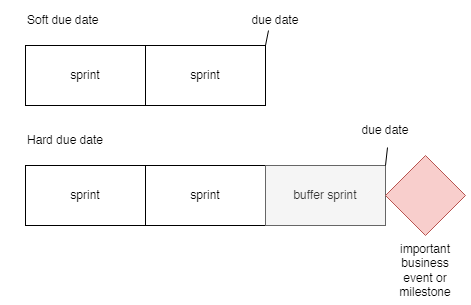
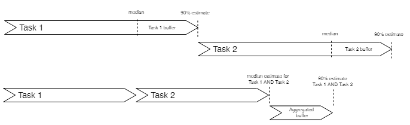
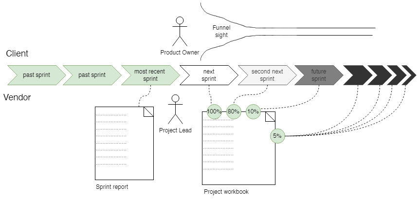

# Sprinting-Ways

Welcome to this introduction to ways of working in Sprinting Software. 

> A leader is one who knows the way, goes the way, and shows the way.
> John C. Maxwell

You may call this the Sprinting methodology or method. We call it Sprinting Ways. 

##

# Project Management concepts

## Product vs project - modes of working

We have two modes of working: 

Product mode/kanban mode: we work on a best effort-basis without critical long-term due dates. The success criteria is to maximize the output of working software given the available capacity. We may still have long-term critical goals but we have flexibility in how the goals are achieved. For instance we may adjust scope to meet the deadline. 

Project mode: we work against a critical long-term due date. The success criteria is to have the project scope delivered in its whole. Missing part of the scope or missing the due date severely limits or even negates the delivered business value. 

It is important to understand that there is a whole spectrum between these two ways of working and most teams will have periods of product mode and other periods of project mode. In addition, project mode often comes in a variant where the due date is fixed whereas the scope or the cost may be negotiable.

We strive toward Product-mode of working for multiple reasons, including: 

- It tends to be more sustainable
- It stays true to the agile spirit of “reacting to change over following a plan”
- It builds upon and enforces trust between the vendor and the customer

Having said that, working in project mode can be extremely valuable and often it is the only meaningful thing in a given context.

Products and Projects have the following differences: 

## Project management principles

About this document

This document describes the core project management principles and practices. The primary target audience is project leads (agile project managers) but developers and stakeholders may find it valuable as well. 

This document is mostly relevant when we are dealing with project-mode of working, not product-mode, see the previous section to understand the difference. 

## Motivation

Project management is the discipline by which we ensure delivery of a project. A project in our context will be defined to be any undertaking carried out collaboratively and carefully planned to achieve a particular aim. A project will have a scope, a budget and a deadline. 

As reliability is a key objective for us, the project management discipline should be mastered by all project leads. 
The high-level principles

Our approach to project management is composed from the following principles:

- A feature-oriented task break-down structure

- Provide “median estimates” (*)

- Aggregate task buffers into a project buffer

- Empower cross-functional teams and keep them fully accountable

- Remember that building software is the art of being practical - not sophisticated 

- Prune the project model to fit your actual needs

(*) Median estimates are defined as estimates which overshoot in 50% of the cases and undershoot in the other 50% of the cases. 
The approach in a nutshell

In a nutshell a project has two phases: 

- The Preparation phase - a short time-boxed activity which involves mostly a few people such as an architect and management. 

- The Execution phase - an iterative process where a fully allocated team works in sprints. The execution phase consists of planned sprints and a buffer sprints. 

In between the two phases, management must ensure a full kit before the project can be started. The following diagram illustrates it. 

## The preparation phase

The preparation phase consists of these steps (bolded terms are defined in later sections):

- Get the full set of input material relevant for the project. This is called the project request material. 

- Fill out the project workbook according to the description in the appendix.

The preparation phase is normally carried out by an architect, a key developer or other senior personel. 

## Ensuring full kit

Ensuring full kit means that certain conditions are met before project execution is allowed to start. The conditions of a full kit are: 

- The project sponsor has approved the project plan which obviously means that all the sections are understood and approved. In detail, it means:

   - the budget needed to cover the sprint plan, the team size and roles is approved 

   - the project sponsor has commited to ensure participation by a product owner on the sprint meetings according to the sprint plan

   - the success criteria are approved by the project sponsor 

   - the project sponsor understands the sprint goals and agrees that they together with the non-functional requirements will cover the intended target system

   - the feature design is being a reasonably accurate description of the desired behavior

   - the dependencies are understood and project sponsor and can commit to them

   - the preliminary assumptions are understood and approved

   - the limitations are approved by the project sponsor

   - the project risks are acknowledged by the project sponsor as possible sources of delays of the project deadline. The listed mitigations are understood and approved. 

   - the solution architecture diagrams are approved

- Management has committed to the staffing plan needed by the project 

Ensuring full kit is a hygiene factor that needs to be counted in to ensure a healthy project and a healthy overall organization. 

## The execution phase - planned sprints

Once the execution phase starts the project workbook is turned into a living document which will be continously changed. 

The execution phase of the project consists of a number of so-called planned sprints followed by a number of buffer sprints. A planned sprint has sprint goals, a buffer sprint has no sprint goals. The purpose of the buffer sprint is to protect the due date and reflect the fact that software projects has a lot of inherint uncertainty and variability. Pretending the opposite is a fallacy. 

Each planned sprint consists of the following high-level activities:

- The sprint goals are implemented, tested and deployed to an agreed environment.

- In the end of the sprint: 

   - A sprint report is produced and sent to the product owner

   - A sprint meeting is performed with the following agenda: 

     - Demo - presenting what has been achieved

     - Scoping - ensuring the scope is well-described, well understood and agreed upon. This is often called backlog refinement. 

     - Planning - ensuring the sprint plan for remaining sprints is updated. 

   - Minutes of meeting are sent out to keep stakeholders informed. 

- During the sprint demo all left-overs from the implemented features will be listed. The left-overs should be estimated.

- The penetration of the project buffer will be calculated as the sum of estimates from all left-overs across all completed sprints. From here the general project health will be inferred according to the formula: 

> Project health = % of project buffer being penetrated / % of non-buffers sprints being completed. 

## The execution phase - buffer sprints

In order to protect the due date and minimize the risk in the project, we add a number of buffer sprints. The number of buffer sprints can vary between 25%-100% of the number of planned sprints. For instance, in a project with a lot of uncertainty we may have 6 planned sprints and 4 buffer sprints. In a less risky project we could have 6 planned sprints and 1 or 2 buffer sprint. 

Buffer sprints may still hold high-level sprint goals such as “GO-LIVE” or “Preprod env working”

## Working against soft and hard due dates
Whenever we work in project mode (see  [Product vs project - modes of working](#project-management-concepts)) the end date of the project is by definition a hard due date. 

When we work in product mode it is a different matter. Not all due dates are equally critical.

This page explains the differences. 

|          |   **Hard due date**  |  **Softdue dates**  |
| -------- | -------------------- | ------------------- |
|Principles| - Hard due dates should be   applied only when needed   - We focus on the critical path of tasks   - We carefully keep track of dependencies,   risks and decisions, see   [Project management principles](#project-management-principles) - We work with milestones and deadlines  - We make sure to have safety buffers at  the end of all our activities, see [Project management principles](#project-management-principles)| - We focus on maximizing the business  value resulting from our efforts. - We consider the due date more like a  desireable outcome but not a must-win battle.  - The project sponsor must understand that the  due date is not guaranteed as no overall project  buffers have been built in. |
|Sucess criteria | - The due date is met. Depending on  the context it may or may not be an  advantage if the project is completed  before the due date or not.|  - The customer gets maximum business  value from the time available.|
|When do we  have hard and  soft due dates | - When we work with low-trust  customers such as new customers       - When critical business milestones  must be met at a certain point in time. - When we have given a fixed price  on a new project. | - When we work with high-trust customers,  such as customer that we already delivered well to.  - When the business does not have critical  milestones depending on our deliveries  - When the customer perceives the work delivered  as best-effort |

The following diagram illustrates the differences between the two different kinds of due dates. 

The criticality of due dates is of course a spectrum ranging from a very soft due date to a very hard due date. The following diagram illustrates this idea: 

It is crucial that the lead and the entire team understand when we deal with very hard due dates. The importance of reaching these due dates is several orders of magnitude more important than meeting the very soft due dates. Understanding the difference allows us to apply our focus, energy and determination when it matters the most. 

Very hard due dates are often called must-win battles or Messi-moments. It takes a tremendous amount of talent and determination to meet fixed due dates in complex software projects. 

 

## Dependencies, risks and decisions
We use three kinds of logs to manage project work. These are logs of dependencies, risks and decisions. To make it clear what we talk about, a **log** is tabular information with status updates on a certain topic. The following is an example decision log. 

|   #       |   **Decision**  |  **Status**  |
| -------- | -------------------- | ------------------- |
|1| *We will build the app in native languages Swift for iOS  and Kotlin for Android* | *2022-04-03: Decision point raised at the sprint meeting   2022-04-17: Decision point agreed over a phone call.* |
|2| *xxx* | *xxx* |

Next let us define them one by one.  

|   **Term**  |  **Definiton**  |
| -------------------- | ------------------- |
| Dependency log|A dependency log is a list of external deliverables (i.e. something to be done that is  outside the control of the sprint team). Each dependency is described by a title and  a responsible person/team. In addition it may have a description and/or a list of  accept criteria depending on the nature of the project. |
| Decision log| A decision log contains decisions and the process around them. The normal process is  that a question comes up during the implementation process and when it has been  answered, it becomes a decision. In the meantime, it is often necessary to turn it into  an assumption so that development activities can be planned around it while  stakeholders takes the decision. The decision log is driven by the need for  stable grounds for the implementation of the project or to minimize the risk of future  disputes. The Decision Log should not manage scope decisions unless they are  significantly impacting the architecture of the solution.   A decision should use an imperative language such as “We will…” or “We should…”. |
|Risk log| The Risk Log gives an overview of the risks managed by the project. Risks are  unknowns that can impact the feasibility of the project (scope, due date or cost).   PS: Security risks are a special kind of risks associated with running software. Such risks is not a part of the project risk log but should rather be part of a company-wide security exception log.
 
# Project management practices

## Introduction to the lead role and the sprint cycle
### **The sprint meeting**

The sprint meeting is a crucial part of our development process. It marks the end of a sprint and the beginning of a new sprint.

A **Sprint Report** is sent out before the meeting and a **Sprint Meeting Summary** is sent out immediately after. Let us go through the three parts: report - meeting - summary. 

### **The sprint report**
**Purpose of the sprint report**
   - To communicate as clearly as possible what has been delivered
   - To proof that certain features were actually working at the time of delivery
   - To allow stakeholders to stay informed even without participation on the sprint meeting. 

**Structure of the sprint report**
   - Delivery summary - summarise on bullet form what has been delivered. This is the pitch of the report. 
   - Staffing - make stakeholders aware of the people working in the team. Mention names and roles. Mention vacation or off-days both of the delivered sprint or coming sprints. 
   - What has been delivered - describe the features delivered in a format that is easily understood by the stakeholders. 
   - Left overs - mention any issues or missing things in the features delivered. 

   We have templates for the sprint report here: https://sprinting.atlassian.net/wiki/pages/createpage.action?spaceKey=SP&title=Sprint%20report%20template%20from%20ClubSalling 

   **Sprint report principles**
  - “Show what is done”: Focus on what has been delivered. Spend time on the details. Remember that quality is about details. 
   - “No burndown charts”: We rarely use burn down charts or other usual metrics used in software projects. Often such charts are speculative and not adding ultimate value (remember, the objective of Sprinting is creating  business value through running software).  
   - “No left-over is too small to mention”: We strive for perfection, hence any bug or missing detail should be  listed in the section of left-overs. We demonstrate our eye for quality in our ability to know exactly what  left-overs we have when we deliver a sprint. 

 ### **The sprint meeting**

 **Purpose of the sprint meeting**

We want the sprint meeting to be a catalyst of information sharing, decision making and coordination so  that the   rest of the sprint is free of discussions, new decisions and changes of direction.This is possible if the sprint meeting   is facilitated in the right way and covers all ground needed.  

**Agenda of the sprint meeting**
   - Demo: Present the output of the most recent sprint. 
   - Scope grooming: Process and clarify what should be delivered in future sprints 
   - Planning: Create the clearest possible priorities for the next sprint and adjust the sprint plan.

**About “Demo”**
   - “Perform live-demos”: Live demos are  effectively communicating what was done. Show it!
   - “Timebox your live demos”: Live-demos can easily get out of control and you can end up spending too much time on it.  Make sure to be well-prepared and disciplined around it. Mix in sprint report walk-throughs to keep the time box. 
   - “Stimulate feedback”: Go slowly and stimulate feedback from stakeholders. Ask them to imagine that we would go to  production tomorrow with the presented feature. Would they miss anything?
   - “Engage stakeholders in dog-footing“: Encourage stakeholders to test the new features themselves where possible.  Make sure you have stable test-environments for stakeholders. If we produce native apps, invest time in build,  deploy and distribution of native apps. 

   **About “Scoping” (also called “refinements”)**

   The purpose of the scoping session is to refine the shared understanding of future features to be built. Sometimes this is called backlog grooming.

The purpose is two-fold:
   - Scope exploration: exploring the features to be built. Describing in greater details how things should work. 
   - Scope alignment: agreeing on priorities for each aspect of the features. 
   
   Scoping can happen in different ways, for instance: 
   - If we are building graphical user interfaces, then we should walk through UX designs and write down stories. 
   - If we have collected input from stakeholders during the sprint (requirements, new ideas etc.) we should analyze  them and add them to the scope breakdown section.

   The scoping session is governed by these principles: 
  - “100-50-5”: A rule of thumb is that scoping must make the next sprint 100% clarified, the next-next sprint 50%  clarified and all other future sprints 5% clarified.

  **About “Planning”**
  The planning session has the following activities: 
    
  - Prioritize left-overs: During the sprint demo and during the writing of the sprint report, we normally find  some left-overs. During the planning we should go through the left-overs and prioritize like this: 
    - Prio 0 = todo immediately
    - Prio 1 = todo on next buffer sprint
    - Prio 2 = todo after the current phase. 
  - Revisit the scope of the next 1-2 sprints: Reconsider how much can be done 
 
 

   ### **The sprint minutes of meeting (MoM)**
   
   **What is Sprint MoM?**
   
A brief email containing all the notes taken during the sprint meeting. The minutes are also saved on Confluence  
so that we can always go back and find minutes. 

**Purpose of the sprint MoM**
   - To clearly inform about the updated project plans so that the risk of future misunderstanding are minimized. 
   - To clearly inform about follow-up actions expected from people outside the delivery team. 
   - To inform everybody about decisions taken on the meetings
    
 

### **Sprint cycle**

The 2-week sprint cycle encompasses the following activities. 
    
 

### **Specification** 

Write down specifications so that developers can implement the desired features. There are no hard rules about how  this is approached and the following is just ideas: 
   - The specification can be written directly into tickets/cards
   - The specification can be written on Confluence pages and tickets can refer to them. 
   - The specification can be high-level or low-level and technical or non-technical
       
 

### **Task break-down and delegation** 

Split the work in tickets.

Find out which developers should be involved in which tasks and assign priority. Delegation is normally most  efficiently done by the lead splitting tasks on developers but other approaches can work as well (for instance  developers picking themselves from a board). 
       
 

### **Coordination** 
If tasks requires coordination among developers, you have to handle that part. Here are some thoughts about how that is done: 
  - Prefer peer-to-peer communication over group communication. Hence, don’t use daily meetings for such things.  Consider more light-weight approaches such as: 
    - Create a slack-thread with the two involved developers and ask them to coordinate. 
    - Write in the ticket to one developer “Ping Peter when you get to this ticket to get further explanation”
    - Write in the ticket “WAIT FOR OK FROM PETER” to indicate that the ticket is waiting for some other person to do   some thing. 
    - Arrange a meeting with the involved developers. 
    
 

### **Verification and feedback** 
The lead is the most important person to verify implemented features and give feedback. The following are core  principles around verification and feedback: 
  - the lead need to spend considerable amount of time on testing during the sprint. 
  - developers need to deliver code continuously throughout the sprint to avoid verification to be piled up. 
  - the lead must both verify behavior and quality
    
 

### **Test case and seed data development** 
As part of the sprint cycle manual test-cases must be written, either by the lead or by some other member of the team.  Test-cases should be written in a way that effectively tests the system with a minimum of effort. 

Test-cases will also allow new-comers to quickly learn about how the platform works. 
    
 

### **Regression testing** 
As part of the release process the lead must make sure proper regression testing is performed on each release.  If possible automation should take care of the regression testing as much as possible. 
    
 

### **Releasing** 
Part of the sprint is to release new versions of the software. The release typically happens in the end of the sprint.
 
 

## Estimates
When we deal with estimates for software development tasks, it is important to understand that many tasks in  software development have a large amount of variability. By variability of a task we mean the uncertainty in time  needed to complete the task. Task variability comes from various sources including: 
  - Two tasks are almost never the same when dealing with software. Hence we don’t really have emperical knowledge  to rely upon.  
  - The task may be underspecified which may hide some complexity of the task
  - Often we have “unplanned work” coming from external factors such as environment issues, build issues etc. 
  - Sometimes the scope of a task is inflated by the good intentions of the product owner and the team itself. 

  The following diagram illustrates the idea that for a given task there could be: 
  - 5% chance that it will be done in 1 week. This could be called the best case. 
  - 50% chance that it will be done in 2 weeks. This is the median estimate. 
  - 95% chance that it will be done in 6 weeks. This could be called worst case. 

### **Statistical fluctuations average out** 
One important observation about the uncertainty of task completion time is the simple fact of statistical fluctuations averaging out.  The following diagram illustrates the idea that given two tasks each having a standard deviation of 4 days, when these tasks are  done one after the other, the standard deviation (uncertainty) is not 8 days but rather 5.6 days.

sigma(T1 + T2) = sqrt(sigma^2(T1) + sigma^2(T2)) = sqrt(8) ~ 5.6

This is the fundamental insight that should make us realize that instead of adding buffers to each task we should rather aggregate  all the buffers and add them to the end of the two tasks. 

### **Appendix** 

The next diagram illustrates the idea that some tasks have a large variability (large uncertainty) and other tasks have a low variability (small uncertainty).  In all cases it is valid to:

 
 
## Typical tasks for a project lead

Development - During the Sprints in which we are developing new features, development tasks occupies majority of my time,  I would say 75-85%. But even in the Sprints that are not focused on the development, I try to deliver new features.  Sometimes those are new things in the admin panel, sometimes those are the features we didn't  have time to implement sooner and sometimes it is the improvement of the existing features, so I would say it is around 40%  of time in those Sprints also.

Top tasks in the development category would be:
  - Creating specifications for developers
  - Breaking down features to tasks
  - Prioritizing the tasks  
  - Tracking the progress
  - Verifying tasks. 
  - Providing additional explanations to developers
  - Communicating with stakeholders to better understand the required feature
  - Creating test cases
  - Creating mock data so we can test the feature
  - Occasional back-end development work
  - Mapping content keys to the design elements in Zeplin
  - Publishing apps to Play Store and App Store 
  - Regression testing
  - Run through new test cases
  - Release backends to production  
  - Data modelling with developers
  - API design discussions with developers
  - Technical discussions about how to implement new features. 
  - Clarifications with other people inside Salling Group, e.g. Gigya related or SAP related
  - Coordination between part-time developers like Sonja and Alexandra 
  - Preparing for the sprint meeting - making sure things are working
  - Writing the sprint report
  - Writing minutes of meetings after sprint meetings.
  - Improve charts in Kibana
  - Troubleshooting issues from Kibana logs

  Bug fixing - We are trying to fix more critical bugs as soon as they are discovered. In Sprints that are not so development focused,  we are fixing the minor bugs from the backlog. It is a bit hard to tell how much time I spent on this since bugs are usual side effect  of development process so fixing them along the way falls under the development. I would say I am spending around 5-10% of time  on fixing of stand alone bugs during development Sprints and probably 15-20% of time during non development Sprints.

  Top tasks in bug fixing category would be:
  - Reproducing reported bugs, so I can create a clear set of steps to reproduce the bug
  - Trying to understand the origin of the bug, so I can create more detailed task for fixing it
  - Creating tasks
  - Verifying if the bug is really fixed
  - Adding test case that covers bug (if possible)

  Maintenance and support - I try to minimize the number of these tasks during development Sprints.   So I try to keep them as low as possible and then to solve them during non development Sprints.  Usually after releasing a new feature set, in the following 2-3 Sprints, number of these tasks intensifies.  I try to spend under 10% of time on these tasks during development Sprints.

Top tasks in Maintenance and support would be:

  - Fixing all sorts of customer related issues (The root cause for majority of these issues is Gigya,  especially the fact we used lite accounts.)
  - Providing stakeholders with statistics and data
  - Going through existing test cases and updating them
  - Helping stakeholders with data preparation
   
   

## More about the sprint meeting
### **Introduction** 
The sprint meeting - also called the "sprint demo" - is the demarcation point between two sprints. It must answer two questions: 
  - Present the results of the sprint just completed. 
  - Agree on the scope for the coming sprints using a so-called funnel sight. 
  - Agree on priorities for the next coming sprints

  The sprint meeting should be planned regularly and it has a high priority to not move the meeting as it determines the end  of a sprint and start of the next. 
   

### **The sprint meeting at a glimpse** 
The idea of the sprint meeting is illustrated here:

Notice the following: 
  - The sprint report describes the output of the most recent sprint. Don’t spend time on describing anything about the future in the sprint report.  Remember that we measure progress by showing running software. Not by speculating about the future. This may seem obvious but in fact it is not.  On many projects the status of a project relies on metrics such as burndown charts, forecast of ETA of ongoing tasks etc.  In Sprinting we try to stay very fact-based by reporting status only on which features are really DONE and we prove it by showing it.  
  - During the “scope grooming” part of the meeting we ensure that the scope of the next sprint is 100% aligned.  For the second next sprint the target is 80% scope alignment and for the next next sprint the target is 10%.  All the future sprints should have 5% scope alignment. 
(*) By **scope alignment** we mean that the scope is described, understood and agreed upon. 
  - During the planning part of the meeting we validate the scope of the coming sprints. The question we ask is that given all that we have learned up to  now, do we still believe the scope is appropriate for the sprint?
   

  ### **Terminology** 
  **Project Workbook:** Living document reflecting the current state of the project. It includes the scope of the project (similar to a Statement of Work),  a detailed description of the features, the sprint plan, a list of dependencies, a decision log, risk assessments, and technical details.

**Pre-analysis:** Fixed "Statement of Work" created before project kick-off. It includes scope,  estimates, and description of features and technical details for  the project.

**Leftovers:** Tasks to do development that was not completed in the sprint

**Back-log:** We tend to avoid the backlog term as it is not accurate enough. Instead we have Left-overs (things we missed for past sprints) and  Feature-sections for future sprints.
 

### **The Process** 

**Before the Sprint meeting**

All Done tasks must be verified and moved to "Pending for sprint report" list in Trello

The day before the sprint meeting, the Project Lead creates the Sprint Report in Confluence and sends a link or a PDF export to the  Product Owner and other relevant stakeholders.  
The Sprint Report must contain detailed descriptions of all that have been implemented during the sprint as well as potential  leftovers or open issues.

**During the Sprint Meeting**

The Project Lead is responsible for running the meeting and for writing notes. It is a good idea to write the  meeting notes on the fly in a shared google doc or Confluence page so that all meeting participants can edit the  notes simultaneously. Another good idea is to use the same Google Document or Confluence page for all meetings  (say "Customer Project Minutes of Meetings") to avoid the need to create new documents all the time. 

**After the Sprint Meeting**

After the meeting, the Project Lead reviews the notes and write the meeting minutes, which he/she then sends over   e-mail to the meeting participants and relevant stakeholders.

The tasks must be re-prioritized together with the Project Owner on the Client's side so that the TODO list contains   tasks planned to be done in the new sprint.
  

### **Agenda** 

It is recommended to follow this agenda:
1. **Scoping (UX presentation)**

The UX lead goes through the new screens and changed designs and this is compared with the feature sections in the workbook.

2. **Sprint Demo**

Live demo of new features build during the sprint combined with walk-through of the sprint report. Remember these guidelines: 

         a. Show on all relevant platforms (iOS/Android/Web). 
         b. Ask carefully if the client considers the features done for production. As if not even a comma 
          was to be changed. Take note of any detail not considered 100% done (these are called left-overs). 
         c. Try only to demonstrate things that were completed during the sprint. If you know that some feature 
         is really half-done, it is often better not to demonstrate it for these reasons: 
            i. You will have to take notes of many left-overs
            ii.You will have to demonstrate it again later when it is completed and the client will feel less 
               engaged as the feature is no longer freshly demonstrated. If feels as if we are seeing the same 
               things over and over. 
            iii. If you don't demonstrate it now, you will have accrued  some "progress" that can fuel the next demo.
                 In other words: doing the opposite of gold-plating.

3. **Planning**

a. Prioritize Leftovers: Create all leftovers and new changes as tasks and prioritize as:

      i. P0: Must be handled as soon as possible in next sprint

     ii. P1: Should be handled in the next-coming buffer sprint

    iii. P2: Can be handled after the current phase. 

b. Update Sprint Plan in the Project Workbook

      i. re-color current sprint as grey.

     ii. Mark down any known dependencies or blockers with a proper estimation of their severity and clear steps to
         mitigating these. Please do not forget to include also the people responsible for the step/s to be done.

    iii. Update the decision log, if any decision came up during the meeting.

     iv. Verify that planned features are done or move to a future sprint.

      v. Update feature sections to reflect possible changes to the developed features. If parts of features are
         postponed to later, then mark this in the feature description

c. Review Next Sprint: Go through the features planned for the next sprint and review and update details. Re-consider the likelihood that the  sprint goals can be achieved and express to the client either certainty or uncertainty to set reasonable expectations given the time, scope and  resources for the sprint. 

## More about the project workbook
### **Introduction** 
You can find the <a href="https://docs.google.com/document/d/1C2O1dA-arnVVqjNYr99HxdgXoJvPZKiYZdBBWxni-8Y/edit">Project Workbook template</a>  here on Google Docs. 

Something to notice: 
The template is self-explanatory but here are a couple of additional advices: 
- Often you evolve from project mode to product mode (cf [Product vs project - modes of working](#project-management-concepts)).  In product mode things usually are handled differently. The workbook is to be used when running a well-defined  project but later when you go into “continuous project” mode it doesn’t necessarily apply. At this point you should  have adopted to a mode of working agreed with the surrounding stakeholders. 

### **How to fill out the project workbook** 

The template is self-explanatory but here are a couple of additional advices: 
- Describe the success criteria and make sure they represent a reasonable description of the ultimate aim of the project  seen from the project sponsor
- Break down the scope in sprint goals. A sprint goal can be either a feature, a milestone or something else. 
- Decide on team size and roles
- Given the team, create a sprint plan showing which sprint goals will be delivered in which sprint.  For this we use median estimates. Add a project buffer corresponding to 50% of the  estimated sprints. See  [Project management concepts](#project-management-concepts) and 
- Often you evolve from project mode to product mode
- Often you evolve from project mode to product mode
- Often you evolve from project mode to product mode
- Often you evolve from project mode to product mode
- Often you evolve from project mode to product mode
- Often you evolve from project mode to product mode
- Often you evolve from project mode to product mode
- Often you evolve from project mode to product mode
- Often you evolve from project mode to product mode
- Often you evolve from project mode to product mode
## The quality assurance approach

## Manual test cases

## The daily meeting

## About Minutes of Meetings (MoM)

# About documentation

## Why documentation is important

## Documentation principles

## The recommended documentation structure

## Standard documents

Our ways of working in one convenient, evolving place.

link to another page: [click](pages/example2.md)
