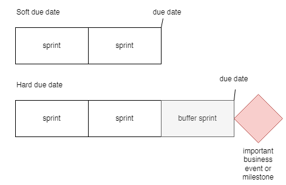

# Project Management concepts

1. [Product vs project - modes of working](#Product-vs-project-modes-of-working)
2. [Project management principles](#Project-management-principles)
3. [Motivation](#Motivation)
4. [The preparation phase](#The-preparation-phase)
5. [Ensuring full kit](#Ensuring-full-kit) 
6. [The execution phase - planned sprints](#The-execution-phase-planned-sprints)
7. [The execution phase - buffer sprints](#The-execution-phase-buffer-sprints)
8. [Working against soft and hard due dates](#Working-against-soft-and-hard-due-dates)
9. [Dependencies, risks and decisions](#Dependencies-risks-and-decisions)

This chapter describes the project management concepts, which form the basis for the [project management practices](pm-practices.md) in the following chapter.

## Product vs project - modes of working 

We have two modes of working:

**Product mode (also called Kanban mode)**: we work on a best effort-basis without time-critical long-term due dates. The success criteria is to maximize the output of working software given the available development capacity. We may still have long-term critical goals but we have flexibility in how the goals are achieved. For instance we may adjust scope to meet the due date.

**Project mode**: we work against a critical long-term due date. The success criteria is to have the project scope delivered in its whole. Missing part of the scope or missing the due date severely limits or even negates the delivered business value.

It is important to understand that there is a whole spectrum between these two ways of working and most teams will have periods of product mode and other periods of project mode. In addition, project mode often comes in a variant where the due date is fixed whereas the exact scope or the cost may be negotiable.

We strive toward Product-mode of working for multiple reasons, including:

- It tends to be more sustainable
- It stays true to the agile spirit of “reacting to change over following a plan”
- It builds upon and enforces trust between the vendor and the customer

Having said that, working in project mode can be extremely valuable and often it is the only meaningful thing in a given context.

Products and Projects have the following differences:

| Product                         | Project                        |
| ------------------------------- | ------------------------------ |
| Permanent (until decommisioned) | Beginning and end date         |
| Long-lived feature team         | Short-term project team        |
| Adaptive planning (iterative)   | Predictive planning (up-front) |
| Continual improvements          | One-off delivery               |
| Evolving customer needs         | Fixed requirements             |

 

## Project management principles 

This section describes the project management principles and practices. The primary target audience is project leads (agile project managers) but developers and other stakeholders may find it valuable as well.

This document is mostly relevant when we are dealing with project-mode of working, not product-mode, see the previous section to understand the difference.

## Motivation 

Project management is the discipline by which we ensure delivery of a project. A project in our context will be defined to be any undertaking carried out collaboratively by multiple people carefully planned to achieve a particular aim. A project will have a scope, a budget and a deadline. The individuals involved may be organized in a single team or multiple teams.

As reliability is a key objective for us, the project management discipline should be mastered by all project leads.

Our approach to project management is composed from the following principles:

- Plan around a feature-oriented task break-down structure

- Provide “median estimates” (\*)

- Aggregate task buffers into a project buffer

- Empower cross-functional teams and keep them fully accountable

- Remember that building software is the art of being practical - not sophisticated

- Prune the project model to fit your actual needs

(\*) Median estimates are defined as estimates which overshoot in 50% of the cases and undershoot in the other 50% of the cases.

In a nutshell a project has two phases:

- **The Preparation phase** - a short time-boxed activity which involves mostly a few people such as an architect and management.

- **The Execution phase** - an iterative process where a fully allocated team works in 2-week sprints. The execution phase consists of planned sprints and one or more buffer sprints.

In between the two phases, management must ensure what is called "full kit" before the project can be started. The following diagram illustrates it.

## The preparation phase 

The preparation phase consists of these steps (bolded terms are defined in later sections):

- Get the full set of input material relevant for the project. This is called the project request material.

- Fill out the project workbook according to the description in the appendix.

The preparation phase is normally carried out by an architect, a key developer or other senior personel.

## Ensuring full kit 

Ensuring full kit means that certain conditions are met before project execution is allowed to start. The conditions of a full kit are:

- The project sponsor has approved the project plan which obviously means that all the sections are understood and approved. In detail, it means:

    - the budget needed to cover the sprint plan, the team size and roles is approved

    - the project sponsor has committed to ensure participation by a product owner on the sprint meetings according to the sprint plan

    - the success criteria are approved by the project sponsor

    - the project sponsor understands the sprint goals and agrees that they together with the non-functional requirements will cover the intended target system

    - the feature design is being a reasonably accurate description of the desired behavior

    - the dependencies are understood and project sponsor and can commit to them

    - the preliminary assumptions are understood and approved

    - the limitations are approved by the project sponsor

    - the project risks are acknowledged by the project sponsor as possible sources of delays of the project deadline. The listed mitigations are understood and approved.

    - the solution architecture diagrams are approved

- Management has committed to the staffing plan needed by the project

Ensuring full kit is a hygiene factor that needs to be counted in to ensure a healthy project and a healthy overall organization.

## The execution phase - planned sprints 

Once the execution phase starts the project workbook is turned into a living document which will be continously changed.

The execution phase of the project consists of a number of so-called planned sprints followed by a number of buffer sprints. A planned sprint has sprint goals, a buffer sprint has no sprint goals. The purpose of the buffer sprint is to protect the due date and reflect the fact that software projects has a lot of inherint uncertainty and variability. Pretending the opposite is a fallacy.

Each planned sprint consists of the following high-level activities:

- The sprint goals are implemented, tested and deployed to an agreed environment.

- In the end of the sprint:

    - A sprint report is produced and sent to the product owner

    - A sprint meeting is performed with the following agenda:

        - Demo - presenting what has been achieved

        - Scoping - ensuring the scope is well-described, well understood and agreed upon. This is often called backlog refinement.

        - Planning - ensuring the sprint plan for remaining sprints is updated.

    - Minutes of meeting are sent out to keep stakeholders informed.

- During the sprint demo all left-overs from the implemented features will be listed. The left-overs should be estimated.

## The execution phase - buffer sprints and project health 

In order to protect the due date and minimize the risk in the project, we add a number of buffer sprints. The number of buffer sprints can vary between 25%-100% of the number of planned sprints. For instance, in a project with a lot of uncertainty we may have 6 planned sprints and 4 buffer sprints. In a less risky project we could have 6 planned sprints and 1 or 2 buffer sprint.

Buffer sprints may still hold high-level sprint goals such as “GO-LIVE” or “Preprod env working”

- The spending of the project buffer will be calculated as the sum of estimates from all left-overs across all completed sprints. From here the general project health will be calculated according to the formula:

> Project health = %-of-project-buffer-spent divided-by %-of-ordinary-sprints-being-completed.

A value below 1 means that we have extra buffer. A value at exactly 1 means we are right on track. A value above 1 means that we are getting behind as we are eating up the buffer time faster than expected.

Consider the following example to better understand:

- 12 ordinary sprints were originally planned + 3 buffer sprints

- 6 of these sprints have been implemented meaning:

> %-of-ordinary-sprints-being-completed = 6/12 = 0.5

- the left-overs from the 6 sprints are estimated to 2 sprints meaning:

> %-of-project-buffer-spent = 2/3 = 0.66

Hence:

> Project health = 0.66 / 0.5 ~= 1.3

Hence, we are getting behind.

If this number is calculated throughout the project, and you plot it over time, then you will get this kind of fever-chart where the colors mean:

- red: we are getting behind

- yellow: we are on track

- green: we are ahead

## Working against soft and hard due dates 

Whenever we work in project mode (see [Product vs project - modes of working](#project-management-concepts)) the end date of the project is by definition a hard due date.

When we work in product mode it is a different matter. Not all due dates are equally critical.

This page explains the differences.

|                 | **Hard due date**                                                                                                                                                                                                                                                                                                                                                                                                                                                    | **Soft due dates**                                                                                                                                                                                                                                                                                                    |
| --------------- | -------------------------------------------------------------------------------------------------------------------------------------------------------------------------------------------------------------------------------------------------------------------------------------------------------------------------------------------------------------------------------------------------------------------------------------------------------------------- | --------------------------------------------------------------------------------------------------------------------------------------------------------------------------------------------------------------------------------------------------------------------------------------------------------------------- | ------------------------------------------------- | ---------------------------------------------------------------------------------------------------------------------------------------------------------------------------------------------------------------------- | ------------------------------------------------------------------------------------------------------------------------------------------------------------------------------------------------------------------------------------------------------------------------ |
| Principles      | - Hard due dates should be   applied only when needed   - We focus on the critical path of tasks   - We carefully keep track of dependencies,   risks and decisions, see   [Project management principles](#project-management-principles) - We work with milestones and deadlines  - We make sure to have safety buffers at  the end of all our activities, see [Project management principles](#project-management-principles) | - We focus on maximizing the business  value resulting from our efforts. - We consider the due date more like a  desireable outcome but not a must-win battle.  - The project sponsor must understand that the  due date is not guaranteed as no overall project  buffers have been built in. |
| Sucess criteria | - The due date is met. Depending on  the context it may or may not be an  advantage if the project is completed  before the due date or not.                                                                                                                                                                                                                                                                                                             | - The customer gets maximum business  value from the time available.                                                                                                                                                                                                                                              | When do we  have hard and  soft due dates | - When we work with low-trust  customers such as new customers  - When critical business milestones  must be met at a certain point in time. - When we have given a fixed price  on a new project. | - When we work with high-trust customers,  such as customer that we already delivered well to.  - When the business does not have critical  milestones depending on our deliveries  - When the customer perceives the work delivered  as best-effort |

The following diagram illustrates the differences between the two different kinds of due dates.

The criticality of due dates is of course a spectrum ranging from a very soft due date to a very hard due date. The following diagram illustrates this idea:

It is crucial that the lead and the entire team understand when we deal with very hard due dates. The importance of reaching these due dates is several orders of magnitude more important than meeting the very soft due dates. Understanding the difference allows us to apply our focus, energy and determination when it matters the most.

Very hard due dates are often called must-win battles or Messi-moments. It takes a tremendous amount of talent and determination to meet fixed due dates in complex software projects.

 

## Dependencies, risks and decisions 

We use three kinds of logs to manage project work. These are logs of dependencies, risks and decisions. To make it clear what we talk about, a **log** is tabular information with status updates on a certain topic. The following is an example decision log.

| #   | **Decision**                                                                          | **Status**                                                                                                               |
| --- | ------------------------------------------------------------------------------------- | ------------------------------------------------------------------------------------------------------------------------ |
| 1   | _We will build the app in native languages Swift for iOS  and Kotlin for Android_ | _2022-04-03: Decision point raised at the sprint meeting   2022-04-17: Decision point agreed over a phone call._ |
| 2   | _xxx_                                                                                 | _xxx_                                                                                                                    |

Next let us define them one by one.

| **Term**       | **Definition**                                                                                                                                                                                                                                                                                                                                                                                                                                                                                                                                                                                                                                                                                                                      |
| -------------- |-------------------------------------------------------------------------------------------------------------------------------------------------------------------------------------------------------------------------------------------------------------------------------------------------------------------------------------------------------------------------------------------------------------------------------------------------------------------------------------------------------------------------------------------------------------------------------------------------------------------------------------------------------------------------------------------------------------------------------------|
| Dependency log | A dependency log is a list of external deliverables (i.e. something to be done that is outside the control of the sprint team). Each dependency is described by a title and a responsible person/team. In addition it may have a description and/or a list of accept criteria depending on the nature of the project.                                                                                                                                                                                                                                                                                                                                                                                                               |
| Decision log   | A decision log contains decisions and the process around them. The normal process is that a question comes up during the implementation process and when it has been answered, it becomes a decision. In the meantime, it is often necessary to turn it into an assumption so that development activities can be planned around it while stakeholders takes the decision. The decision log is driven by the need for stable grounds for the implementation of the project or to minimize the risk of future disputes. The Decision Log should not manage scope decisions unless they are significantly impacting the architecture of the solution. A decision should use an imperative language such as “We will…” or “We should…”. |
| Risk log       | The Risk Log gives an overview of the risks managed by the project. Risks are unknowns that can impact the feasibility of the project (scope, due date or cost). PS: Security risks are a special kind of risks associated with running software. Such risks is not a part of the project risk log but should rather be part of a company-wide security exception log.                                                                                                                                                                                                                                                                                                                                                              |

Back to the [main document](README.md).
