# Project management practices

1. [Introduction to the lead role and the sprint cycle](#Introduction-to-the-lead-role)
2. [Estimates](#Estimates)
3. [Typical tasks for a project lead](#Typical-tasks-for-a-project-lead)
4. [More about the sprint meeting](#More-about-the-sprint-meeting)
5. [More about the project workbook](#More-about-the-project-workbook)
6. [The quality assurance approach](#The-quality-assurance-approach)
7. [About Minutes of Meeting (MoM)](#About-Minutes-of-Meeting)
8. [About Documentation](#About-documentation)

This chapter describes the project management practices.

## Introduction to the lead role and the sprint cycle 

### **The sprint meeting**

The sprint meeting is a crucial part of our development process. It marks the end of a sprint and the beginning of a new sprint.

A **Sprint Report** is sent out before the meeting and a **Sprint Meeting Summary** is sent out immediately after. Let us go through the three parts: report - meeting - summary.

### **The sprint report**

**Purpose of the sprint report**

- To communicate as clearly as possible what has been delivered
- To proof that certain features were actually working at the time of delivery
- To allow stakeholders to stay informed even without participation on the sprint meeting.

**Structure of the sprint report**

- Delivery summary - summarise on bullet form what has been delivered. This is the pitch of the report.
- Staffing - make stakeholders aware of the people working in the team. Mention names and roles. Mention vacation or off-days both of the delivered sprint or coming sprints.
- What has been delivered - describe the features delivered in a format that is easily understood by the stakeholders.
- Left overs - mention any issues or missing things in the features delivered.

We have templates for the sprint report here: https://sprinting.atlassian.net/wiki/pages/createpage.action?spaceKey=SP&title=Sprint%20report%20template%20from%20ClubSalling

**Sprint report principles**

- “Show what is done”: Focus on what has been delivered. Spend time on the details. Remember that quality is about details.
- “No burndown charts”: We rarely use burn down charts or other usual metrics used in software projects. Often such charts are speculative and not adding ultimate value (remember, the objective of Sprinting is creating business value through running software).
- “No left-over is too small to mention”: We strive for perfection, hence any bug or missing detail should be listed in the section of left-overs. We demonstrate our eye for quality in our ability to know exactly what left-overs we have when we deliver a sprint.

### **The sprint meeting**

**Purpose of the sprint meeting**
We want the sprint meeting to be a catalyst of information sharing, decision-making and coordination so that the rest of the sprint is free of discussions, new decisions and changes of direction.This is possible if the sprint meeting is facilitated in the right way and covers all ground needed.

**Agenda of the sprint meeting**
- Demo: Present the output of the most recent sprint.
- Scope grooming: Process and clarify what should be delivered in future sprints
- Planning: Create the clearest possible priorities for the next sprint and adjust the sprint plan.

**About “Demo”**
- “Perform live-demos”: Live demos are effectively communicating what was done. Show it!
- “Time box your live demos”: Live-demos can easily get out of control and you can end up spending too much time on it. Make sure to be well-prepared and disciplined around it. Mix in sprint report walk-throughs to keep the time box.
- “Stimulate feedback”: Go slowly and stimulate feedback from stakeholders. Ask them to imagine that we would go to production tomorrow with the presented feature. Would they miss anything?
- “Engage stakeholders in dog-footing“: Encourage stakeholders to test the new features themselves where possible. Make sure you have stable test-environments for stakeholders. If we produce native apps, invest time in build, deploy and distribution of native apps.

**About “Scoping” (also called “refinements”)**

The purpose of the scoping session is to refine the shared understanding of future features to be built. Sometimes this is called backlog grooming.

The purpose is two-fold:
- Scope exploration: exploring the features to be built. Describing in greater details how things should work.
- Scope alignment: agreeing on priorities for each aspect of the features.

Scoping can happen in different ways, for instance:
- If we are building graphical user interfaces, then we should walk through UX designs and write down stories.
- If we have collected input from stakeholders during the sprint (requirements, new ideas etc.) we should analyze them and add them to the scope breakdown section.

The scoping session is governed by these principles:
- “100-50-5”: A rule of thumb is that scoping must make the next sprint 100% clarified, the next-next sprint 50% clarified and all other future sprints 5% clarified.

**About “Planning”**

The planning session has the following activities:

- Prioritize left-overs: During the sprint demo and during the writing of the sprint report, we normally find some left-overs. During the planning we should go through the left-overs and prioritize like this:
    - Prio 0 = todo immediately
    - Prio 1 = todo on next buffer sprint
    - Prio 2 = todo after the current phase.
- Revisit the scope of the next 1-2 sprints: Reconsider how much can be done
 
 

### **The sprint minutes of meeting (MoM)**

**What is Sprint MoM?**

A brief email containing all the notes taken during the sprint meeting. The minutes are also saved on Confluence
so that we can always go back and find minutes.

**Purpose of the sprint MoM**
- To clearly inform about the updated project plans so that the risk of future misunderstanding are minimized.
- To clearly inform about follow-up actions expected from people outside the delivery team.
- To inform everybody about decisions taken on the meetings
 
 

### **Sprint cycle**

The 2-week sprint cycle encompasses the following activities.
 
 

### **Specification**

Write down specifications so that developers can implement the desired features. There are no hard rules about how this is approached and the following is just ideas:

- The specification can be written directly into tickets/cards
- The specification can be written on Confluence pages and tickets can refer to them.
- The specification can be high-level or low-level and technical or non-technical
 
 

### **Task break-down and delegation**

Split the work in tickets.

Find out which developers should be involved in which tasks and assign priority. Delegation is normally most efficiently done by the lead splitting tasks on developers but other approaches can work as well (for instance developers picking themselves from a board).
 
 

### **Coordination**

If tasks requires coordination among developers, you have to handle that part. Here are some thoughts about how that is done:

- Prefer peer-to-peer communication over group communication. Hence, don’t use daily meetings for such things. Consider more light-weight approaches such as: - Create a slack-thread with the two involved developers and ask them to coordinate. - Write in the ticket to one developer “Ping Peter when you get to this ticket to get further explanation” - Write in the ticket “WAIT FOR OK FROM PETER” to indicate that the ticket is waiting for some other person to do something. - Arrange a meeting with the involved developers.
 
 

### **Verification and feedback**

The lead is the most important person to verify implemented features and give feedback. The following are core principles around verification and feedback:

- the lead need to spend considerable amount of time on testing during the sprint.
- developers need to deliver code continuously throughout the sprint to avoid verification to be piled up.
- the lead must both verify behavior and quality
 
 

### **Test case and seed data development**

As part of the sprint cycle manual test-cases must be written, either by the lead or by some other member of the team. Test-cases should be written in a way that effectively tests the system with a minimum of effort.

Test-cases will also allow new-comers to quickly learn about how the platform works.
 
 

### **Regression testing**

As part of the release process the lead must make sure proper regression testing is performed on each release. If possible automation should take care of the regression testing as much as possible.
 
 

### **Releasing**

Part of the sprint is to release new versions of the software. The release typically happens in the end of the sprint.
 
 

## Estimates 

When we deal with estimates for software development tasks, it is important to understand that many tasks in software development have a large amount of variability. By variability of a task we mean the uncertainty in time needed to complete the task. Task variability comes from various sources including:

- Two tasks are almost never the same when dealing with software. Hence we don’t really have empirical knowledge to rely upon.
- The task may be underspecified which may hide some complexity of the task
- Often we have “unplanned work” coming from external factors such as environment issues, build issues etc.
- Sometimes the scope of a task is inflated by the good intentions of the product owner and the team itself.

The following diagram illustrates the idea that for a given task there could be:

- 5% chance that it will be done in 1 week. This could be called the best case.
- 50% chance that it will be done in 2 weeks. This is the median estimate.
- 95% chance that it will be done in 6 weeks. This could be called worst case.

### **Statistical fluctuations average out**

One important observation about the uncertainty of task completion time is the simple fact of statistical fluctuations averaging out. The following diagram illustrates the idea that given two tasks each having a standard deviation of 4 days, when these tasks are done one after the other, the standard deviation (uncertainty) is not 8 days but rather 5.6 days.

sigma(T1 + T2) = sqrt(sigma^2(T1) + sigma^2(T2)) = sqrt(8) ~ 5.6

This is the fundamental insight that should make us realize that instead of adding buffers to each task we should rather aggregate all the buffers and add them to the end of the two tasks.

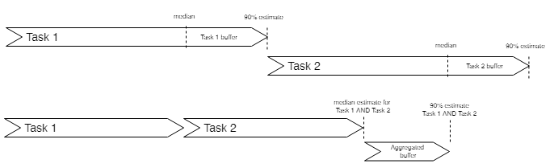

### **Appendix**

The next diagram illustrates the idea that some tasks have a large variability (large uncertainty) and other tasks have a low variability (small uncertainty). In all cases it is valid to:

 
 

## Typical tasks for a project lead 

Development - During the Sprints in which we are developing new features, development tasks occupies majority of my time, I would say 75-85%. But even in the Sprints that are not focused on the development, I try to deliver new features. Sometimes those are new things in the admin panel, sometimes those are the features we didn't have time to implement sooner and sometimes it is the improvement of the existing features, so I would say it is around 40% of time in those Sprints also.

Top tasks in the development category would be:
- Creating specifications for developers
- Breaking down features to tasks
- Prioritizing the tasks
- Tracking the progress
- Verifying tasks.
- Providing additional explanations to developers
- Communicating with stakeholders to better understand the required feature
- Creating test cases
- Creating mock data so we can test the feature
- Occasional back-end development work
- Mapping content keys to the design elements in Zeplin
- Publishing apps to Play Store and App Store
- Regression testing
- Run through new test cases
- Release backends to production
- Data modelling with developers
- API design discussions with developers
- Technical discussions about how to implement new features.
- Clarifications with other people inside Salling Group, e.g. Gigya related or SAP related
- Coordination between part-time developers like Sonja and Alexandra
- Preparing for the sprint meeting - making sure things are working
- Writing the sprint report
- Writing minutes of meetings after sprint meetings.
- Improve charts in Kibana
- Troubleshooting issues from Kibana logs

Bug fixing - We are trying to fix more critical bugs as soon as they are discovered. In Sprints that are not so development focused, we are fixing the minor bugs from the backlog. It is a bit hard to tell how much time I spent on this since bugs are usual side effect of development process so fixing them along the way falls under the development. I would say I am spending around 5-10% of time on fixing of standalone bugs during development Sprints and probably 15-20% of time during non development Sprints.

Top tasks in bug fixing category would be:
- Reproducing reported bugs, so I can create a clear set of steps to reproduce the bug
- Trying to understand the origin of the bug, so I can create more detailed task for fixing it
- Creating tasks
- Verifying if the bug is really fixed
- Adding test case that covers bug (if possible)

Maintenance and support - I try to minimize the number of these tasks during development Sprints. So I try to keep them as low as possible and then to solve them during non development Sprints. Usually after releasing a new feature set, in the following 2-3 Sprints, number of these tasks intensifies. I try to spend under 10% of time on these tasks during development Sprints.

Top tasks in Maintenance and support would be:
- Fixing all sorts of customer related issues (The root cause for majority of these issues is Gigya, especially the fact we used lite accounts.)
- Providing stakeholders with statistics and data
- Going through existing test cases and updating them
- Helping stakeholders with data preparation
 
 

## More about the sprint meeting 

### **Introduction**

The sprint meeting - also called the "sprint demo" - is the demarcation point between two sprints. It must answer two questions:

- Present the results of the sprint just completed.
- Agree on the scope for the coming sprints using a so-called funnel sight.
- Agree on priorities for the next coming sprints

The sprint meeting should be planned regularly, and it has a high priority to not move the meeting as it determines the end of a sprint and start of the next.
 

### **The sprint meeting at a glimpse**

The idea of the sprint meeting is illustrated here:
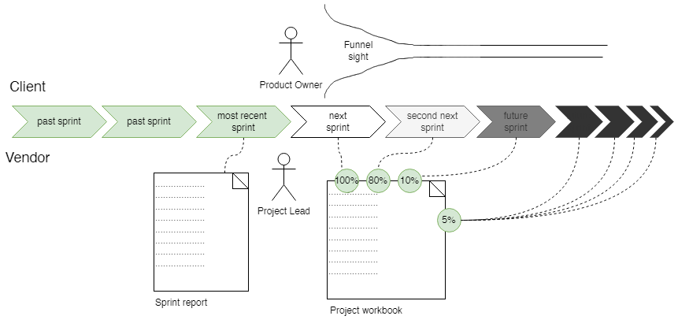
Notice the following:
- The sprint report describes the output of the most recent sprint. Don’t spend time on describing anything about the future in the sprint report. Remember that we measure progress by showing running software. Not by speculating about the future. This may seem obvious but in fact it is not. On many projects the status of a project relies on metrics such as burn-down charts, forecast of ETA of ongoing tasks etc. In Sprinting we try to stay very fact-based by reporting status only on which features are really DONE and we prove it by showing it.
- During the “scope grooming” part of the meeting we ensure that the scope of the next sprint is 100% aligned. For the second next sprint the target is 80% scope alignment and for the next next sprint the target is 10%. All the future sprints should have 5% scope alignment.
  (\*) By **scope alignment** we mean that the scope is described, understood and agreed upon.
- During the planning part of the meeting we validate the scope of the coming sprints. The question we ask is that given all that we have learned up to now, do we still believe the scope is appropriate for the sprint?
 

### **Terminology**

**Project Workbook:** Living document reflecting the current state of the project. It includes the scope of the project (similar to a Statement of Work), a detailed description of the features, the sprint plan, a list of dependencies, a decision log, risk assessments, and technical details.

**Pre-analysis:** Fixed "Statement of Work" created before project kick-off. It includes scope, estimates, and description of features and technical details for the project.

**Leftovers:** Tasks to do development that were not completed in the sprint.

**Backlog:** We tend to avoid the backlog term as it is not accurate enough. Instead, we have Left-overs (things we missed for past sprints) and Feature-sections for future sprints.
 

### **The Process**

**Before the Sprint meeting**

All Done tasks must be verified and moved to "Pending for Sprint report" list in Trello.

The day before the sprint meeting, the Project Lead creates the Sprint Report in Confluence and sends a link or a PDF export to the Product Owner and other relevant stakeholders.
The Sprint Report must contain detailed descriptions of all that have been implemented during the sprint as well as potential leftovers or open issues.

**During the Sprint Meeting**

The Project Lead is responsible for running the meeting and for writing notes. It is a good idea to write the meeting notes on the fly in a shared Google doc or Confluence page so that all meeting participants can edit the notes simultaneously. Another good idea is to use the same Google Document or Confluence page for all meetings (say "Customer Project Minutes of Meetings") to avoid the need to create new documents all the time.

**After the Sprint Meeting**

After the meeting, the Project Lead reviews the notes and write the meeting minutes, which he/she then sends over e-mail to the meeting participants and relevant stakeholders.

The tasks must be re-prioritized together with the Project Owner on the Client's side so that the TODO list contains tasks planned to be done in the new sprint.
 

### **Agenda**

It is recommended to follow this agenda:

1. **Scoping (UX presentation)**

The UX lead goes through the new screens and changed designs and this is compared with the feature sections in the workbook.

2. **Sprint Demo**

Live demo of new features build during the sprint combined with walk-through of the sprint report. Remember these guidelines:

         a. Show on all relevant platforms (iOS/Android/Web).
         b. Ask carefully if the client considers the features done for production. As if not even a comma
          was to be changed. Take note of any detail not considered 100% done (these are called left-overs).
         c. Try only to demonstrate things that were completed during the sprint. If you know that some feature
         is really half-done, it is often better not to demonstrate it for these reasons:
            i. You will have to take notes of many left-overs
            ii.You will have to demonstrate it again later when it is completed and the client will feel less
               engaged as the feature is no longer freshly demonstrated. If feels as if we are seeing the same
               things over and over.
            iii. If you don't demonstrate it now, you will have accrued  some "progress" that can fuel the next demo.
                 In other words: doing the opposite of gold-plating.

3. **Planning**

a. Prioritize Leftovers: Create all leftovers and new changes as tasks and prioritize as:

      i. P0: Must be handled as soon as possible in next sprint

     ii. P1: Should be handled in the next-coming buffer sprint

    iii. P2: Can be handled after the current phase.

b. Update Sprint plan in the Project Workbook

      i. re-color current sprint as grey.

     ii. Mark down any known dependencies or blockers with a proper estimation of their severity and clear steps to
         mitigating these. Please do not forget to include also the people responsible for the step/s to be done.

    iii. Update the decision log, if any decision came up during the meeting.

     iv. Verify that planned features are done or move to a future sprint.

      v. Update feature sections to reflect possible changes to the developed features. If parts of features are
         postponed to later, then mark this in the feature description

c. Review Next Sprint: Go through the features planned for the next sprint and review and update details. Re-consider the likelihood that the sprint goals can be achieved and express to the client either certainty or uncertainty to set reasonable expectations given the time, scope and resources for the sprint.
 
 

## More about the project workbook 

### **Introduction**

You can find the <a href="https://docs.google.com/document/d/1C2O1dA-arnVVqjNYr99HxdgXoJvPZKiYZdBBWxni-8Y/edit">Project Workbook template</a> here on Google Docs.

Something to notice:
The template is self-explanatory but here are a couple of additional advices:

- Often you evolve from project mode to product mode (cf [Product vs project - modes of working](#project-management-concepts)). In product mode things usually are handled differently. The workbook is to be used when running a well-defined project but later when you go into “continuous project” mode it doesn’t necessarily apply. At this point you should have adopted to a mode of working agreed with the surrounding stakeholders.

### **How to fill out the project workbook**

The template is self-explanatory but here are a couple of additional advices:

- Describe the **success criteria** and make sure they represent a reasonable description of the ultimate aim of the project seen from the **project sponsor**
- Break down the scope in **sprint goals.** A sprint goal can be either a feature, a milestone or something else.
- Decide on team size and roles
- Given the team, create a **sprint plan** showing which sprint goals will be delivered in which sprint. For this we use **median estimates.** Add a project buffer corresponding to 50% of the estimated sprints. See [Project management concepts](pm-concepts.md) and [Estimates](#Estimates)
- For each feature-oriented sprint goal, create a dedicated section in the “functional view” to spell out the intended feature design.
- List down all **milestones** mentioned in the sprint plan and describe accept criteria.
- List down all **dependencies** and describe accept criteria and the responsible party and link to them in the sprint plan.
- List down all **assumptions** in the **Preliminary assumptions** section
- List down all **limitations** in the **Limitation log**
- List down all project risks in the **risk log**
- Extract all **non-functional requirements**
- Create a couple of solution architecture diagrams showing the bigger picture of the solution
 
 

## The quality assurance approach 

### **Introduction**

We need a quality assurance approach that will bring us as close as possible to zero errors in deliveries and operations.

### **Types of tests**

- Automated API tests
- Automated UI tests
- Manual tests - the full test suite
- Regression tests - a subset of the manual test suite

### **We should strive for “no errors”**

Our attitude is that we should strive for “no errors” in releases and operations. This is in theory impossible, but the attitude makes us constantly move toward perfection.

### **Reaching 0 errors is asymptotic in cost”**

As we are trying to reach 0 errors the cost of effort grows indefinitely. Conclusions:

- Sometimes errors will happen
- We need to apply more sophisticated techniques than growing a regression test suite endlessly - the next section describes the techniques.
 
 

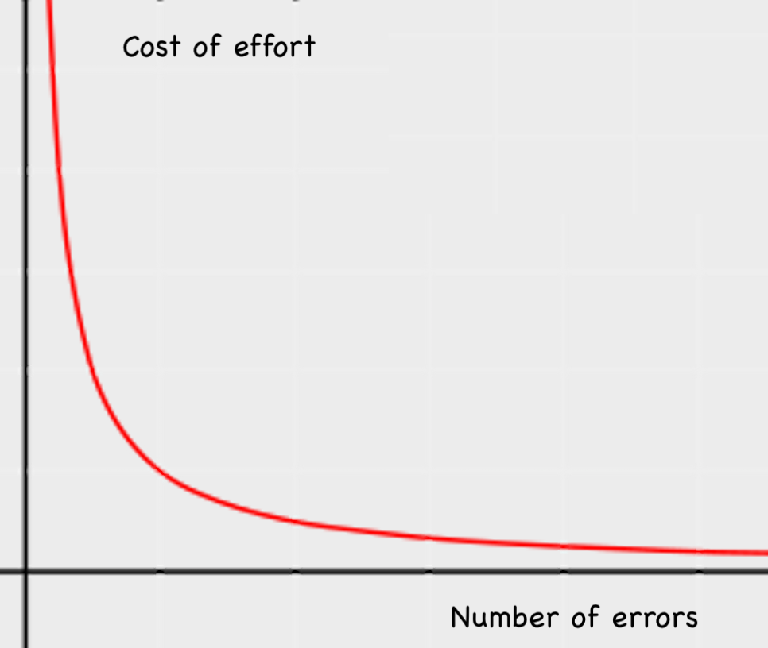

### **How to reach “no errors””**

**Kaizen**

The most fundamental principle in reaching “no errors” is the simple idea of constant learning from errors and implementing mitigations to prevent the same error from happening again.

We should distinguish between ensuring quality in releases and quality of daily operations.

NB: Kaizen is Japanese for continuous improvements.

**Ensuring quality of releases**

Quality of releases comes from a combination of multiple things:
| **Discipline** | **Description** |
| -------------------- | ------------------- |
| Smoke test|A manual test that is intentionally very short, yet testing top 3 use cases of the system. The smoke test is normally performed in production right after releasing, and it protects against total failures. |
| Heartbeat monitoring of “our” services| Continuously calling both our own endpoints. The purpose is to have a crystal clear indication of when certain services started to break. If a new release breaks one of the endpoints, then we  will immediately know from the heartbeat monitoring. |
|Green-Blue deployment of backends| Deploying new versions of the software in a parallel deployment track, monitor errors in the new track and fall back if errors are detected|
|Backend integration tests| Larger tests of API-calls testing for errors or known output. Integration tests can be hand-coded or based on record-replay-compare techniques.|
|Functional test cases| Manual tests covering all functionalities of the system. Manual test cases are also important in order for new people to learn about the inner workings of the product.|
|Regression test | Manual tests performed when releasing new versions of software. The regression test can be a subset  of the Functional test-cases, or it can be standalone test defined in a different way.|
|Log monitoring of the release cut-over| Manual inspection of logs from various sources like Kibana or server logs (CPU, memory, db connections etc.) with a focus on detecting “patterns of change” starting from the point in time when the  new release was launched.To make this inspection even more efficient, we should be able to filter logs on  version number so that we can see which version causes errors.|
|Canary releases|Similar idea to Green-Blue deployments but here only certain users will get to the new release.  For instance, all Salling Group employee and Sprinting employee could run against the canary release and  only when we have properly verified that the release is healthy, we will push other users to the new release.|
|Backend unittests| Smaller self-contained tests running on backend-components. These tests cannot depend on out side things.|
|Incident process| We must have a thorough incident process to make sure we learn and improve from each incident.|

 

**Ensuring quality of operations**

Ensuring quality of operations is about how to have “no errors” during daily operations irrespectively of new releases.

The techniques applied here involves the following.

| **Discipline**                         | **Description**                                                                                                                                                                                                                                                                                                                                                           |
| -------------------------------------- | ------------------------------------------------------------------------------------------------------------------------------------------------------------------------------------------------------------------------------------------------------------------------------------------------------------------------------------------------------------------------- |
| Heartbeat monitoring of “our” services | Continuously calling both our own endpoints. The purpose is to have a crystal clear indication  of when certain services started to break. If a new release breaks one of the endpoints, then we  will immediately know from the heartbeat monitoring.                                                                                                            |
| Daily log monitoring                   | Daily manual inspection of logs from various sources like Kibana or server logs (CPU, memory,  db connections etc.). The inspection should focus on detecting “patterns of change” in error codes,  response times etc. It is a continuous effort to be able to assess that the platform is healthy and  often it is based on many heuristical considerations |
| Alarms                                 | Automatic notification of personel as soon as some issue is detected from heartbeats or logs.                                                                                                                                                                                                                                                                             |

 

### **Further explanation of QA disciplines””**

**Backend integration tests**

Integration tests can be done in many clever ways some of which are illustrated on this diagram.

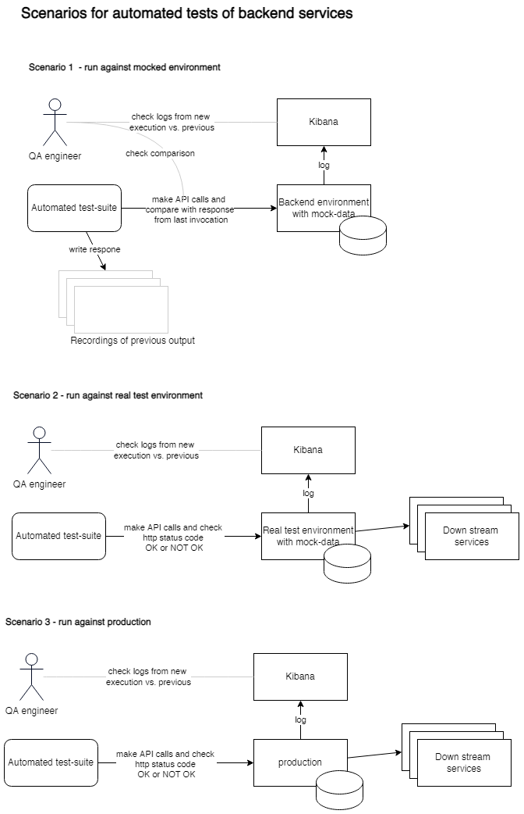

**Heartbeat monitoring of “our” services**

- Call each of our own endpoints once every 10 seconds
- Check the status code is OK
- Optionally compare output if a fixed output is expected
- Make heartbeat results available on a dashboard in AWS, Grafana or Kibana.

**Heartbeat monitoring of “our” services**

The release version can be encoded in the log-traffic which means we can monitor the old version versus the  new version and look for patterns of bad behavior.

Error heatmap from previous version:

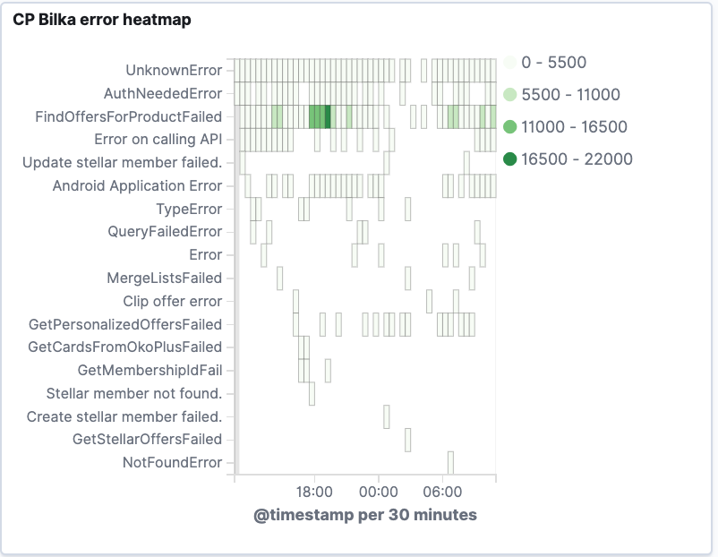

Error heatmap from new version:

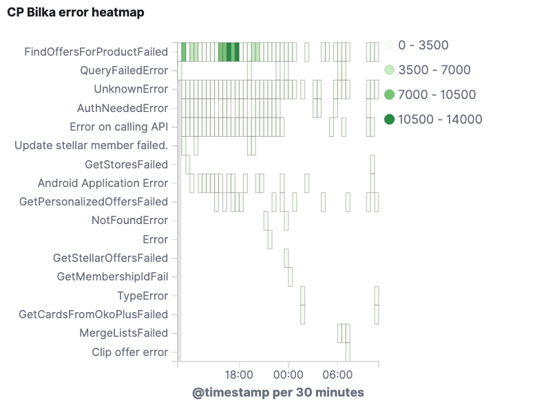

**Green-Blue deployment of backends**

The idea is to deploy to production in two parallel tracks called “Blue track” and “Green track” and be in exact control of:

- how many users will be in the blue track and how many will be in the green track
- loadbalancer update

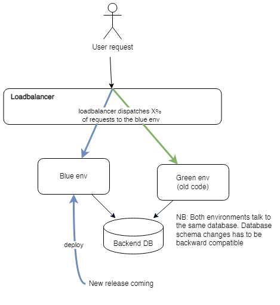

**Canary releases**

The idea of canary releases is illustrated here.

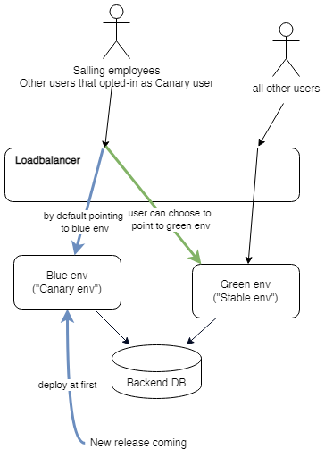

**The incident process**

We must have a thorough incident process to make sure we learn and improve from each incident.  This is illustrated on the next diagram.

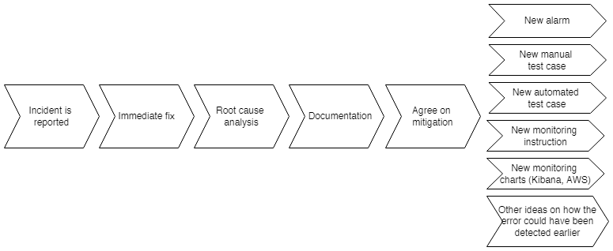
 
 

## Manual test cases

We use manual test cases to do the kind of testing of a platform that cannot be automated. In this article,  when we say 'test cases' we mean manual test cases.

Test cases should be:

- **efficient:** Test cases should maximize the coverage of the system while minimizing the effort needed to carry them out.
- **concrete:** Test cases should mention concrete values of actions you do, input you give, output you validate etc. to ensure that test cases are deterministic.
- **creative:** Find clever ways of testing things quicker through "dirty tricks" like:
    - DevSupport (hidden menus with special functions)
    - time travelling - manage the system time and create the ability to forward and reset the time of the system
    - logging of events in ELK or Application Insight. One example is an order flow where you search the logs for the orderId and hence verify the system behavior through logs.
- **semi-automated:** Don't see automated and manual testing as opposites. Often a very good result can be obtained in between. You might have ways of invoking small automated sequences of steps inside the system that can help you move faster.
- **based on carefully crafted test data that are seeded into all environments (excluding production):** Make sure you prepare the right data in the right environments so that time needed to bring the system into the right state is minimized. For instance, if you need to check the behavior for 10 different user roles, make sure you have 10 different predefined users with the correct roles and easy to remember name and login.
- **enabler of automation:** robust and maintainable automated end-to-end tests (like Selenium or Cypress) are built on top of efficient manual test-cases. Hence automation of end-to-end tests should be done after a foundation of efficient manual tests have been created.

 
When manual test cases are done right they provide:

- An efficient way for you to verify that nothing is broken during releasing
- An efficient way for newcomers to the project to learn about the platform
- A valuable source about how the system actually works. User manuals can easily be written using the test cases as a starting point.
- Automation of UI tests can be done using the foundation created by the test cases as automated UI tests rely on the same ideas of high-quality test data.

To create efficient manual test-cases you often have to:

- Mock out external API’s or at least make it possible to run a certain environment in mock-mode
- Create easy back-doors for non-production environment that will allow you to login with a click (not a real login)
   
   

## The daily meeting

The purpose of the daily meeting is to create the optimal single point of contact for the whole team. The daily meeting can be used in any way the team thinks makes sense, but here are the common principles:

- We like to have a focus on what tasks are DONE as it:
    - creates a clear feeling of progress
    - allow us to do quick demonstrations on the meeting and give immediate feedback
    - allow people to try it out right after the meeting
- We do not talk about what each person is in the middle of doing as it would double the time spent talking about each task (as we also would mention it when it was done).
- We do not talk about what issues individual developers has, as issues are addresses and handled continuously during the day.
- People may mention issues they are facing but mostly to agree on "after-meetings" which are short meetings held right after the daily meeting with fewer participants.
- We do not talk about tasks waiting to be started because: - It would double the time spent on talking about each task (because we also talk about it when it is done) - extra input for the tasks should be requested continuously and outside the meeting
- there is a risk that tasks waiting to be started will never get priority.
 
 

## About Minutes of Meetings (MoM) 

### **Introduction**

This page describes what role Minutes of Meetings plays in Sprinting Software and the practices around it.

### **Purpose of minutes**

We use minutes as a key ingredient of stakeholder management. The idea is this:

- Take leadership in meetings by defining key takeaways from the meetings
- Be in control of what actions and decision are taken out of the meeting
- Show proactivity and insist on that meetings should produce an outcome
- Make sure to have documentation well-preserved

### **Practices**

On meetings the minutes plays a central role in the stakeholder management. The following should be noted:

- The minutes are used to write down various takeaways from the sprint meeting
- Minutes should be written down while the participants see it so that they are validated on the meeting, and we have no further processing of them in the hindsight.
- The minutes should be preserved on Google Doc or Confluence. I recommend using one long page getting longer and longer where new minutes are added on the top.
- Using Confluence or Google Doc has the advantage that minutes can be written collaboratively which sometimes is handy.

### **Structure of MoM**

It can be helpful to keep a consistent structure on MoM. One possible structure is this:

- **Immediate TODOs:** Any actions for immediate follow-up identified on the meeting. Please note that this does not include:
    - tasks for the development team as these should either be left-overs or added somewhere in the workbook for future sprints
    - future tasks for future sprints as these should be added somewhere in the workbook, for instance as a dependency (if the task is outside the Sprinting team) or as a story/task/requirement in the feature sections.
- **Decisions:** key questions discussed and agreed upon on the meeting. The same decision could be added to the decision log in the workbook if you see some future dispute coming from it.
- **Discussion points:** Anything that doesn’t fit the above.

If you are on a sprint meeting you may have this additional section:

- **Left-overs:** this section is only relevant if you demonstrate stuff on the sprint meeting, as any demonstration of the software tends to produce “left-overs” (things we can improve). The good thing about having such a section is that it is a relief for both stakeholders and the lead to be able to note down any detail about the delivered software that doesn’t seem perfect. Left-overs should be prioritized before the end of the meeting so that it is clear what should be fixed in the coming sprint and what should not.

As a lead you can grow your own habits around the process and you can find your own MoM structure for sprint meetings. The above is only one suggestions.
 
 

# About documentation 

Documentation is not a primary outcome of agile software projects. In fact, one of the key agile principles is to “value working software over comprehensive documentation”. Nevertheless documentation is still a key ingredient in how we build software.

The following pages describes the approach to documentation in Sprinting:

- **Why documentation is important**
- **Documentation principles**
- **The recommended documentation structure**
- **Standard documents**
 
 

## Why documentation is important

Let us first agree on the following fact of life: Building software is a complex undertaking relying on a substantial amount of auxiliary activities which on the individual level includes thinking, reading and learning and on the organizational level includes documenting, meeting and communicating. This is illustrated here:

The effectiveness of all the auxiliary activities can be boosted if we have the right documentation habits because effective documentation can be read to support thinking, speed up learning, skip meeting and replace talking and listening to some extent.

Understanding and describing what documentation to produce is challenging. We need to answer the following questions about a given piece of documentation:

- Why produce it?
- When should we produce it?
- Who should produce it?
- Who is the audience?
- What should be the format of documentation?
- In which context does it fit? (Folder structure)
- To what level of detail should we document?

 

## Documentation principles 

### **About this document**

The purpose of this document is to describe how we work with documentation in Sprinting projects.  
The purpose is to organise the information in ways that supports our ways of working.

### **Documentation structure and ways of working**

The documentation structure will in many ways reflect our ways of working - and vice versa. In classic waterfall projects you will have a number of phases and for each phase you will have a number of deliverables. This process - though not very effective for our field of industry - is simple to describe and the documentation structure easy to infer. On some hypothetical project it might look like this:

- Analysis
    - High-level Requirements.docx
    - Success criteria.docx
- Design
    - Logical Data model.docx
    - User stories.docx
- Detailed design:
    - Accept criteria.docx
    - Physical Data model.docx

In our company things become more complicated for the following reasons:

- We need tailor-suited ways of working fitting to each project. We can’t use a one-size-fits-all approach. In spirit of the agile principles of valuing “working software over extensive documentation” we want to produce as little documentation as possible while still reaching our short-term and long-term goals. Hence, each agile project should only produce documentation that makes sense to the project.
- As the documentation is never a goal in itself, any document started has a risk of not being completed. This is opposed to a waterfall project where documents are a first-class delivery of the project method and hence proper time and management attention is allocated for it.
- We work across many different customers and each customer will often have its own project management method which we will have to fit it.

For this reason the documentation structure used in Sprinting is more like a set of elements you can choose from as a lead. Depending on the context of your work you can choose bigger or smaller parts of the documentation structure presented next.

### **Introduction to documentation structures**

The documentation structure is a tree structure where **sections** contains other sections or documents and a document has no child-elements. Sometimes we may use the word **folder** as a synonym for the word section.

A document may naturally have **paragraphs** which creates a logical information structure within the document.

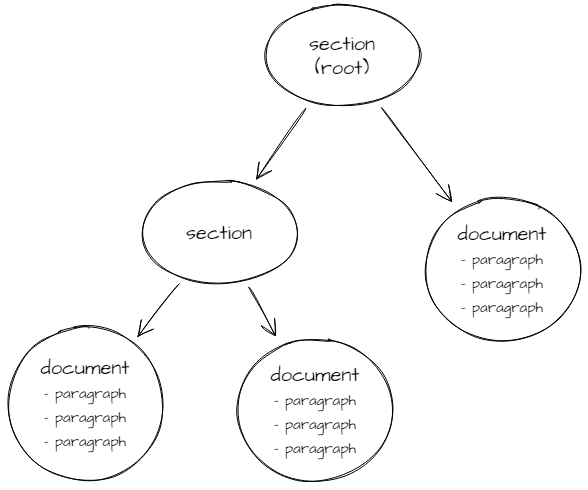

Here is an example of a documentation structure from a Mac computer showing two sections (“design” and “technical design”)  and two documents.

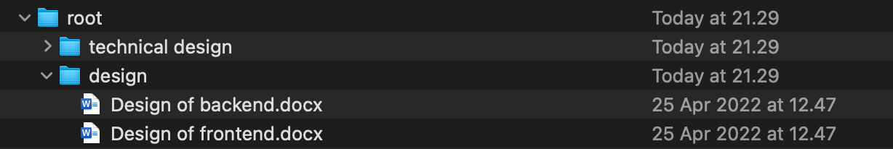

Here is an example of a documentation structure from Confluence showing two sections (“Documentation principles” and “Documentation templates”) and three pages inside them.

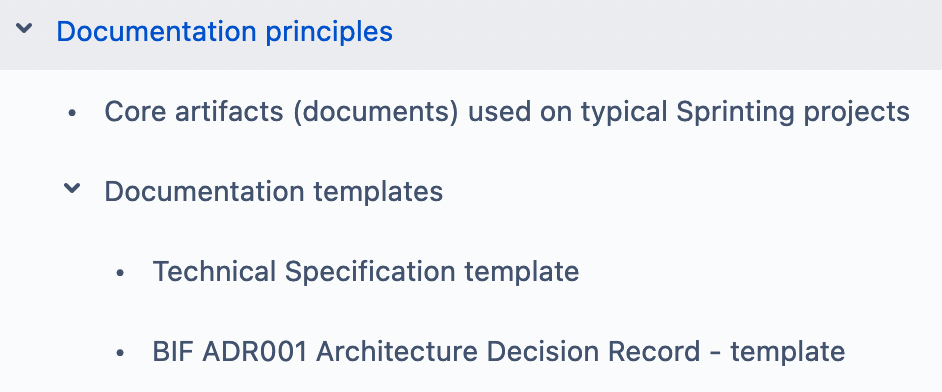

### **Document state and type**

For any document we can consider the _state_ and the _type._ These are defined next.

- The **state** of a document is any of the following:
    - **WIP**: work-in-progress - a document that is still actively being written and henceforth it cannot yet be considered fully valid or complete.
    - **UPDATED**: an **updated** document is a document that is correct on its topic. An updated document should not contain invalid or misleading information.
    - **STALE**: a **stale** document is a document that has grown old and dusty and not properly updated. It may still have value for some readers. A STALE document is still subject to possible future updates which may change the state to UPDATED. Sometimes we may say that a document is **obsolete** as an extreme degree of being stale. However, obsolete is a more subjective judgement meaning that for certain kinds of readers this document is no longer worth reading.
- The document will go through these states in the **life-cycle** of the document as depicted below. We have indicated the states with the checkbox-icon and the warning icon.

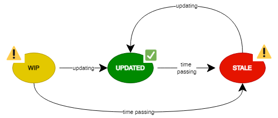

- We will distinguish between these **types** of documents or section of documents:
    - **Governed document**: A governed document is a document with a strict process around it concerning approval or rejection of the document. Governed documents are used to create strong gates such as security approval, architecture approval etc. Good examples of governed documents are:
        - Architecture Blueprint
        - Architectural Decision Records.
    - **Journal**: A **journal** is a special kind of documentation used like an append-only log. You can think of a journal like a diary or a log book. JOURNAL documents are created at a very specific point in time and it should never be updated later. Journal documents by definition become stale over time, yet has a value as long as the reader understands the context of the document. Good examples of a JOURNAL are:
        - A sprint report
        - Minutes of meetings documents
        - Decision records
    - **Always updated**: A document is said to be **always updated** if it is intended to be kept up to date at any point in time. Good examples of such documents are:
        - A sprint plan
        - An org chart
    - **Mixed state**: A document is said to be in a **mixed state** if it is allowed to be either updated, WIP or stale. Good examples of such documents are:
        - Development handbook articles
        - Various how-to articles

We will use the following LEGEND in the diagrams to come.

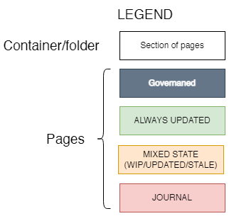

### **Documents and templates**

Certain documents may have a specific **template** which is a predefined set of paragraphs that are either mandatory or optional for that template.

### **Classification of folders and documents**

| **Name of document/folder** | **Project or System?**             | **Purpose**                                                                                                                                                                                                                                                                                                                                                                                                                   | **Name convention** (_examples_)            | **Actors and contributions**                                                                                                   | **Content**                                                                                                                                                                                                                                                                                           |
| --------------------------- | ---------------------------------- | ----------------------------------------------------------------------------------------------------------------------------------------------------------------------------------------------------------------------------------------------------------------------------------------------------------------------------------------------------------------------------------------------------------------------------- | ------------------------------------------- | ------------------------------------------------------------------------------------------------------------------------------ | ----------------------------------------------------------------------------------------------------------------------------------------------------------------------------------------------------------------------------------------------------------------------------------------------------- |
| Project Workbook            | Project                            | A live document  A description of how a certain project is executed.                                                                                                                                                                                                                                                                                                                                                      | {name} workbook                             | Author: Project lead                                                                                                           | <ul><li>Project plan /sprint plan</li><ul><li>Timeline</li><li>Goals / milestones</li><li>Dependencies</li></ul></ul><ul><li>Risks</li><li>Staffing</li><li>Assumptions</li><li>Limitations</li><li>Stakeholders</li><li>Reporting conventions</li><li>...</li></ul>                                  |
| Analysis and Design         | System                             | A description of how a certain area of a software system should work. The functional specifications should ideally be done pr. system area but it may depend on the nature of the project.                                                                                                                                                                                                                                | AD{id} - {name} AD33 - Punch cards      | Author: Product owner, business analyst, project lead, client  Reader: product owner, project lead or partially developers | <ul><li>Requirements</li><li>UX/mockups</li><li>Stories</li><li>Use cases</li><li>Success criteria</li></ul>                                                                                                                                                                                          |
| Test Case                   | System                             | A description of how to test and verify a certain feature or aspect of a platform.  The test cases should be done pr. system area (just like the other kind of documents).                                                                                                                                                                                                                                                | TC{id} - {name}  TC33 - Punch cards     | <ul><li>Author: Project lead or QAs</li><li>Reader: Project lead or QAs</li></ul>                                              | <ul><li>Instructions on how to verify different functional aspects of the system. </li></ul>                                                                                                                                                                                                          |
| Technical Specification     | System                             | A description of how a certain area of a software system is implemented.  The technical specifications are done pr. system area (just like the functional specifications). The technical specifications are long-term documents that should be maintained and extended as the system evolves. The technical specifications should be the first place to read for new developers diving into a certain area of the system. | SPEC{id} - {name}  SPEC33 - Punch cards | Author: Project lead or developers or an architect  Reader: developers                                                     | <ul><li>Overall description of the system area from a developers point of view</li><li>Data model / domain model</li><li>API design</li></ul> Optionaly:<ul><li>Architecture diagrams: </li><ul><li>Collaboration/activity diagram</li><li>Deployment diagram</li><li>Sequence diagram</li></ul></ul> |
| Task descriptions           | Azure DevOps  (ticket systems) | Tasks are supposed to be mostly used during the development of a task and not for long term documentation.                                                                                                                                                                                                                                                                                                                    |                                             |                                                                                                                                | <ul><li>Just enough information to allow the developer to build it.</li><li>Reference technical specifications where needed.</li></ul>                                                                                                                                                                |
| Source code documentation   |                                    |                                                                                                                                                                                                                                                                                                                                                                                                                               |                                             |                                                                                                                                | <ul><li>Readme files</li></ul>                                                                                                                                                                                                                                                                        |
| API documentation           |                                    |                                                                                                                                                                                                                                                                                                                                                                                                                               |                                             |                                                                                                                                | <ul><li>Swagger documentation</li></ul>                                                                                                                                                                                                                                                               |

### **Revolving naming conflicts**

When the above structure is implemented in Confluence, we will have a conflict with the constraint that two pages or sections  cannot have the same name in the same Confluence space. To resolve this conflict we will follow this convention:

Each system gets an official abbreviation such as BIF for BifrostBackend. Then instead of Solution Blueprint we can write BIF Solution Blueprint
 
 

## The recommended documentation structure

### **Introduction**

This page describes the recommended structure for both project-level and system-level documentation. A system is another  word for application or product, hence, the system-level structure also applies when you build a product.

To understand in more depth what goes into which document, see [Standard documents](#standard-documents)

### **Project-level documentation**

The following shows the recommended folder structure for projects.

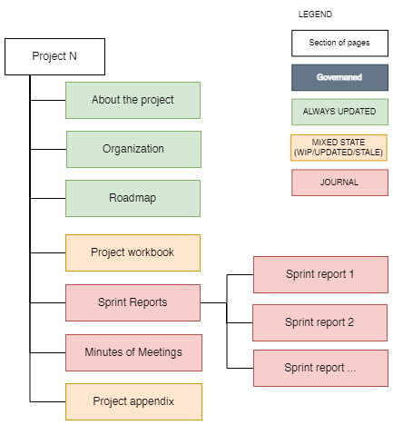

### **Product-level documentation**

For cross-going technical system documentation we recommend the following structure.

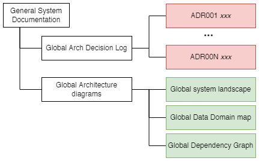

### **Product-level documentation (detailed)**

For each system (or application or service depending on what it is called in your business context) we recommend the  following structure.

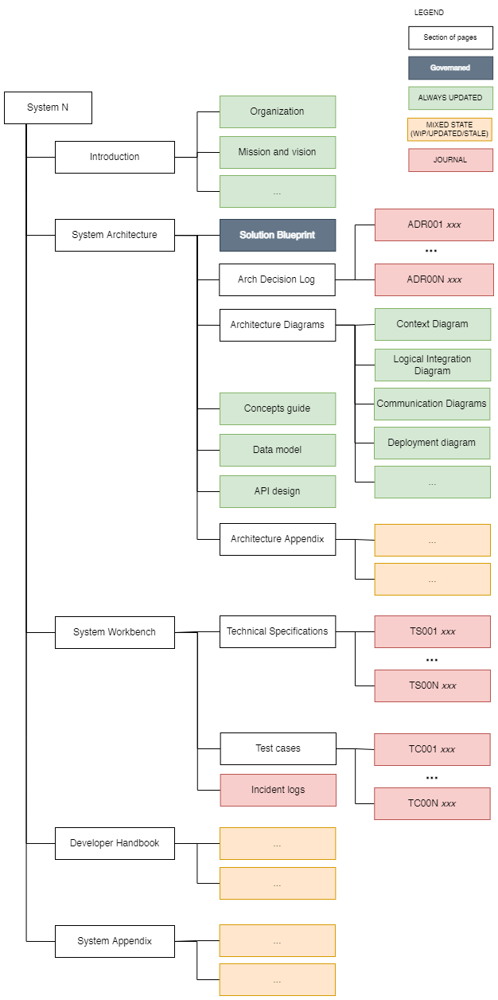
 
 

## Standard documents

| **Name of section / document** | **Purpose**                                                                                                                                                                                                                                                                                                                                                                                                                   | **Name convention**  _examples_     | **Roles** _suggestions/it depends_                                                                          | **Typical content or link to template**                                                                                                                                                                                                                                                               |
| ------------------------------ | ----------------------------------------------------------------------------------------------------------------------------------------------------------------------------------------------------------------------------------------------------------------------------------------------------------------------------------------------------------------------------------------------------------------------------- | --------------------------------------- | --------------------------------------------------------------------------------------------------------------- | ----------------------------------------------------------------------------------------------------------------------------------------------------------------------------------------------------------------------------------------------------------------------------------------------------- |
| Project Workbook               | Contains all elements needed to manage a project such as sprint plan, decision log, risk log and dependency log.                                                                                                                                                                                                                                                                                                              | {project-name} workbook                 | Author: Project lead   Reader: Stakeholders                                                                 | [More about the project workbook](#more-about-the-project-workbook)                                                                                                                                                                                                                                   |
| Functional Specification       | A description of how a certain area of a software system should work. The functional specifications should ideally be done pr. system area but it may depend on the nature of the project.                                                                                                                                                                                                                                | FS{id} - {name} FS33 - Punch cards  | Author: Product owner, business analyst, project lead, client  Reader: project lead or partially developers | <ul><li>Requirements</li><li>UX/mockups</li><li>Stories</li><li>Use cases</li><li>Success criteria</li></ul>                                                                                                                                                                                          |
| Technical Specification        | A description of how a certain area of a software system is implemented.  The technical specifications are done pr. system area (just like the functional specifications). The technical specifications are long-term documents that should be maintained and extended as the system evolves. The technical specifications should be the first place to read for new developers diving into a certain area of the system. | TC{id} - {name}  TC33 - Punch cards | Author: Project lead or developers                                                                              | <ul><li>Overall description of the system area from a developers point of view</li><li>Data model / domain model</li><li>API design</li></ul> Optionaly:<ul><li>Architecture diagrams: </li><ul><li>Collaboration/activity diagram</li><li>Deployment diagram</li><li>Sequence diagram</li></ul></ul> |
| Test Case                      | A description of how to test and verify a certain feature or aspect of a platform.  The test cases should be done pr. system area (just like the other kind of documents).                                                                                                                                                                                                                                                | TC{id} - {name}  TC33 - Punch cards |                                                                                                                 |                                                                                                                                                                                                                                                                                                       |

 
Our ways of working in one convenient, evolving place.

 
 

Back to the [main document](README.md).
